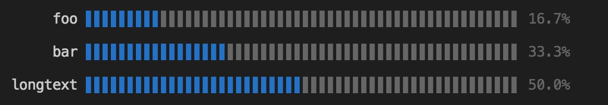

# cli-barchart

Fancy and customizable bar chart in your terminal




# Installation

for npm users

```bash
npm i cli-barchart
```

for yarn users

```bash
yarn add cli-barchart
```

# Usage

```js
const bar = require( 'cli-barchart' )
const chalk = require( 'chalk' )

const chartString = bar.default( [
  {
    key: 'foo',
    value: 0.1,
  },
  {
    key: 'bar',
    value: 0.2
  },
  {
    key: 'longtext',
    value: 0.3
  }
], {
  // max width of bar, default is 1/3 of terminal columns
  maxWidth: 10,

  // bar color, default is blue
  colorize: ( item, index, items ) => chalk.green,

  // label after bar, default is percentage calculated from `item.value` / sum
  renderLabel: ( item, index, items ) => chalk.green( item.value ),
} )

console.log( chartString )
```

# License

MIT
